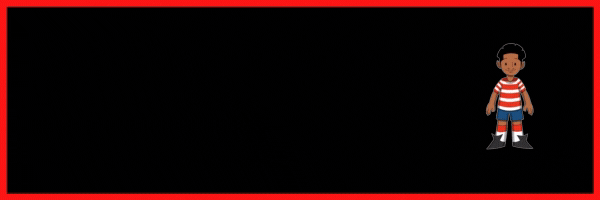

## Hello I'm keshawn, 👋 💻
  </img>
  
 Hi, I’m Keshawn. I am a Full stack web developer with a particular interest in front-end development. My specialties include Javascript, AngularJs, SASS, React and Redux, Jest, and Less. After multiple years spent collaborating, building, and swotting projects in web applications I’ve developed strong creative problem-solving, organizational, and communication skills. 
<!--
**KeshawnSharper/KeshawnSharper** is a ✨ _special_ ✨ repository because its `README.md` (this file) appears on your GitHub profile.

Here are some ideas to get you started:

- 🔭 I’m currently working on ...
- 🌱 I’m currently learning ...
- 👯 I’m looking to collaborate on ...
- 🤔 I’m looking for help with ...
- 💬 Ask me about ...
- 📫 How to reach me: ...
- 😄 Pronouns: ...
- ⚡ Fun fact: ...
-->
